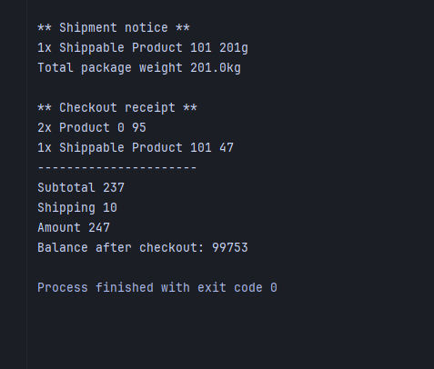
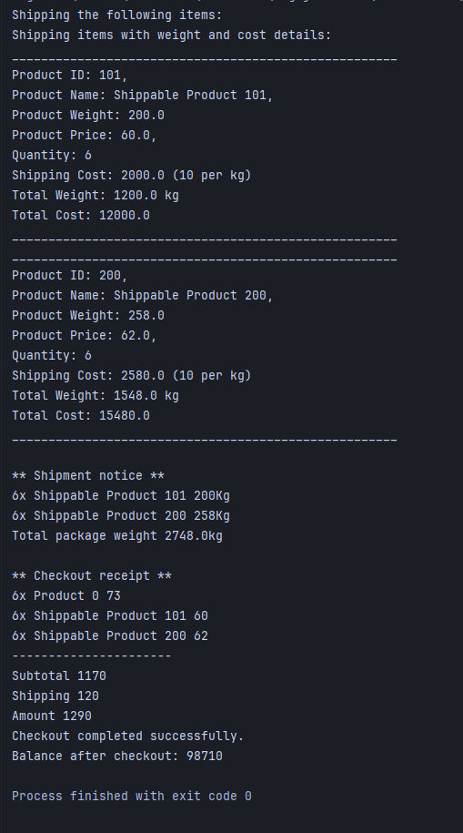
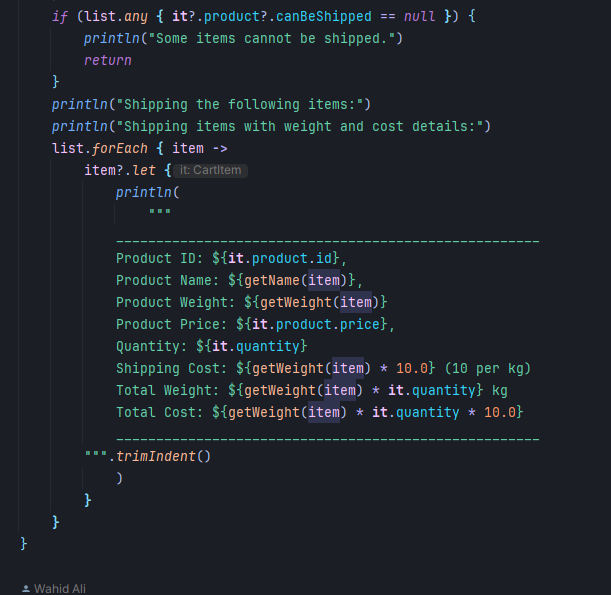
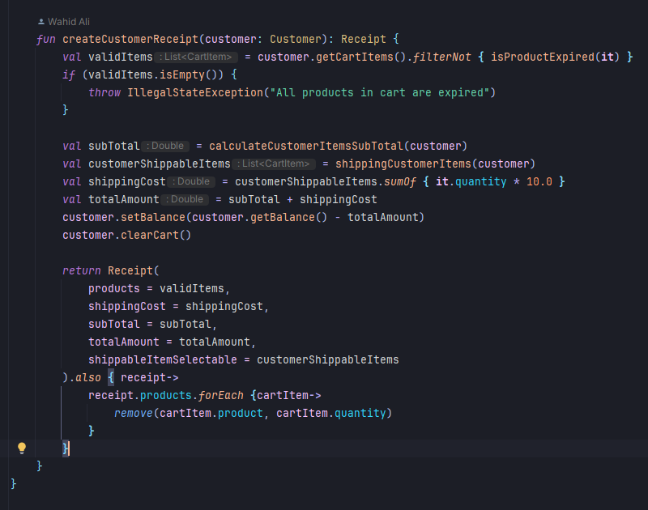
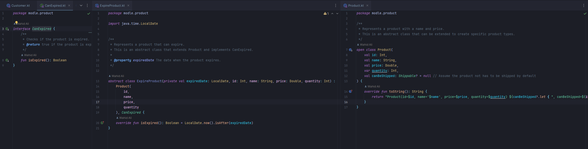

# Shopping Cart System

## Overview
This project is a simple shopping cart system implemented in Kotlin and Java. It allows customers to add products to their cart, calculate totals, handle shipping, and generate receipts. The system includes features such as balance management, shipping cost calculation, and receipt generation.

## Features
- **Customer Management**: Manage customer balance and cart operations.
- **Cart Operations**: Add, remove, update quantities, and clear items in the cart.
- **Shipping**: Handle shippable items and calculate shipping costs.
- **Checkout**: Generate receipts with detailed information about purchased items, shipping costs, and remaining balance.

## Technologies Used
- **Languages**: Kotlin, Java
- **Build Tool**: Gradle

## Project Structure
- `src/main/kotlin/modle/customer/Customer.kt`: Represents the customer and their cart operations.
- `src/main/kotlin/modle/customer/Cart.kt`: Handles cart operations such as adding, removing, and updating items.
- `src/main/kotlin/modle/customer/CartItem.kt`: Represents individual items in the cart.
- `src/main/kotlin/modle/customer/Receipt.kt`: Represents the receipt generated after checkout.
- `src/main/kotlin/service/checkout/CheckoutService.kt`: Handles checkout operations, including calculating totals and shipping items.
- `src/main/kotlin/service/shipping/ShippingService.kt`: Manages shipping operations for shippable items.
- `src/main/kotlin/Main.kt`: Entry point of the application.

## How to Run
1. Clone the repository.
2. Open the project in IntelliJ IDEA.
3. Build the project using Gradle.
4. Run the `Main.kt` file to execute the application.

## Examples Usage

## Code Snapshots

----------------------
